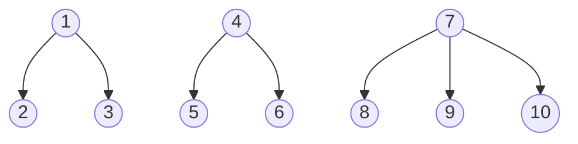
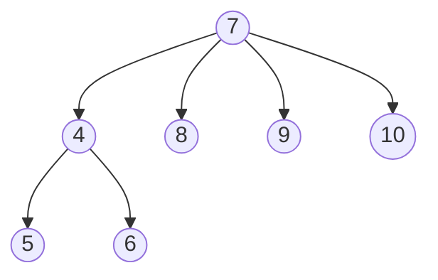
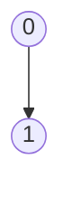
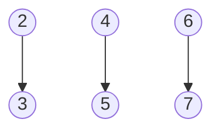
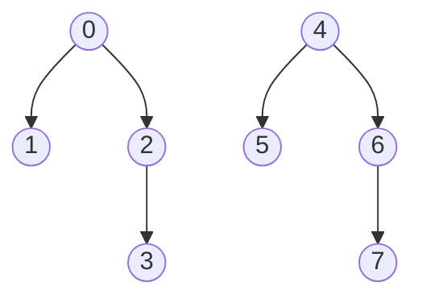
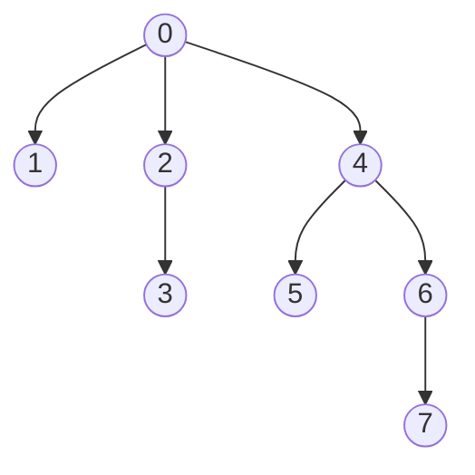

#  مجموعه‌های مجزا / Disjoint Set 
## فهرست

فرض کنید یک مجموعه کلی U را داریم.
```text 
U={1,2,3,4,5,6,7,8,9,10}
```
حال می‌خواهیم این مجموعه را به مجموعه های مجزا (جدا از هم) تبدیل کنیم. سه مجموعه‌ی s1 و s2 و s3 را بصورت زیر در نظر بگیرید.
<br>
```text
s1={1,2,3}   s2={4,5,6}   s3={7,8,9,10}
```
یکی از کاربرد‌های درخت، نمایش مجموعه‌هاست.
این سه مجموعه را می‌توان با استفاده از درخت، به صورت زیر نمایش داد.


s1, s2, s3:

<br>


### نام‌گذاری این مجموعه ها: 
می‌توان برای نام‌گذاری مجموعه، از ریشه درخت مربوطه‌اش استفاده کرد. در واقع ریشه هر درخت، نماینده آن مجموعه است و مجموعه با آن نام‌گذاری می‌شود.
<br>
پس...
<br>
مجموعه s1  را مجموعه 1،
<br>
مجموعه s2 را مجموعه 4،
<br>
و مجموعه s3  را مجموعه 7 می‌نامیم.
<br>
__________________________________________________________________________________________________________________________________________
###  تا اینجا دیدیم که هر مجموعه با یک درخت نشان داده می‌شود و ریشه هر  درخت، نماینده آن مجموعه هست. حال یک سوال اصلی برایمان پیش می‌آید:
چگونه می‌توان دو مجموعه را باهم ادغام کرد و در عین حال به سرعت بتوان تشخیص داد هر عنصر به کدام مجموعه تعلق دارد؟
<br>
با استفاده از ساختمان داده‌ای به نام **Disjoint Set Union (DSU)** می‌توان این کار را انجام داد.
<br> 
این ساختار دو عملیات اصلی دارد:   Union  و Find

### 1- عملیات Union (i,j): 
عملیاتی است که دو مجموعه جدا از هم i و j را به هم وصل می‌کند و تبدیل به یک مجموعه واحد می‌کند. 
(اجتماع دو مجموعه)
<br>
برای یافتن اجتماع دو مجموعه، کافیست ریشه یکی از درخت ها را، پدر ریشه درخت دیگر قرار دهیم. تنها نکته ای که باید به آن توجه داشت قانونی هست به نام **قانون وزنی /  Weighting rule**.
**با توجه به این قانون ریشه درختی که نود‌های بیشتری دارد، پدر ریشه درختی می‌شود که نود‌های کمتری دارد.**
<br>
بنابراین، اجتماع دو مجموعه s2 و s3 به شکل زیر خواهد بود:
<br>

 
Union (4,7):



### 2- عملیات Find (i): 
ریشه مجموعه‌ای که i عضو آن است را برمی‌گرداند. برای مثال در شکل بالا:
<br>
```text 
Find(10)=7  ,  Find(4)=7  ,  Find(5)=7  ,  Find(6)=7
```
__________________________________________________________________________________________________________________________________________
برای نمایش مجموعه‌ها می‌توان از آرایه‌ای به نام parent استفاده کرد. مثلا شکل آرایه ای مجموعه های s1 و s2 و s3 به صورت زیر است:

| index  | 1  | 2 | 3 | 4  | 5 | 6 | 7  | 8 | 9 | 10 |
|--------|----|---|---|----|---|---|----|---|---|----|
| parent | -3 | 1 | 1 | -3 | 4 | 4 | -4 | 7 | 7 |  7 |


#### مقدار parent[i]:

1️⃣ اگر i ریشه باشد: **parent[i]= -j** که j تعداد نود های درخت i است.
<br>
2️⃣ اگر i  ریشه نباشد: **parent[i]= j** که j پدر i است.
<br>

#### بنابر این عمل Union (i,j) به صورت زیر است:

```c
int temp=parent[i]+parent[j];
if (parent[i]>parent[j]) // i has fewer nodes
{parent[i]=j; parent[j]=temp;}
else {parent[j]=i; parent[i]=temp;}
```
#### عمل find[i] نیز به صورت زیر است:
```c
while (parent[i]>=0) i=parent[i];
return i;
```
###  مثال: 
فرض کنید
| index  | 0  | 1  | 2  |  3 | 4  | 5  | 6  | 7  |
|--------|----|----|----|----|----|----|----|----|
| parent | -1 | -1 | -1 | -1 | -1 | -1 | -1 | -1 | 
 
<br>
یعنی 8 مجموعه مجزای تک عنصری داریم. عملیات زیر را انجام دهید.
<br>
union (0,1) , union(2,3) , union(4,5) , union(6,7) , union(0,2) , union(4,6) , union(0,4)

### پاسخ:

<p dir="rtl">union(0,1)1️⃣: </p>




| index  | 0  | 1  | 2  |  3 | 4  | 5  | 6  | 7  |
|--------|----|----|----|----|----|----|----|----|
| parent | -2 | 0  | -1 | -1 | -1 | -1 | -1 | -1 | 
<br>
<p dir="rtl">union(2,3), union(4,5), union(6,7)2️⃣: </p>





| index  | 0  | 1  | 2  |  3 | 4  | 5  | 6  | 7  |
|--------|----|----|----|----|----|----|----|----|
| parent | -2 | 0  | -2 |  2 | -2 | 4  | -2 | 6  |
<br>
<p dir="rtl">union(0,2), union(4,6)3️⃣: </p>



| index  | 0  | 1  | 2  |  3 | 4  | 5  | 6  | 7  |
|--------|----|----|----|----|----|----|----|----|
| parent | -4 | 0  | 0  |  2 | -4 | 4  | 4  | 6  |
<br>
<p dir="rtl">union(0,4)4️⃣: </p>




| index  | 0  | 1  | 2  |  3 | 4  | 5  | 6  | 7  |
|--------|----|----|----|----|----|----|----|----|
| parent | -8 | 0  | 0  |  2 | 0  | 4  | 4  | 6  |

<br>
در اینجا عمل find(7) به تعداد 3 بار بررسی یال انجام می‌دهد.

```text
1️⃣find(7)=6  ,  2️⃣find(6)=4  ,  3️⃣find(4)=0  => parent[0]<0
```
### نکته:
ارتفاع درخت حاصل از union  برای n  عدد، حداکر برابر با $\lfloor \log_2 n \rfloor$ +1
 است.
### نکته: 
مرتبه عمل union هر بار $O(1)$ و مرتبه عمل find، $O(\log_2 n)$
است.


##  سوالات چهار گزینه‌ای:
1️⃣ فرض کنید دو مجموعه داریم.
مجموعه 4 با 3 نود (ریشه 4) 
و
 مجموعه ی 5 با 4 نود ( ریشه 5).
 اگر union(5,4) طبق قانون وزنی انجام شود، کدام ریشه به پدر دیگری تبدیل می‌شود؟
 <br>
 a)ریشه 5 پدر ریشه 4 می‌شود.
 <br>
 b) ریشه 4 پدر ریشه 5 می‌شود.
 <br>
 c) هیچکدام، دو مجموعه جدا از هم می‌مانند.
 <br>
 d) هردو گزینه اول ممکن است رخ دهد.
 <br>


